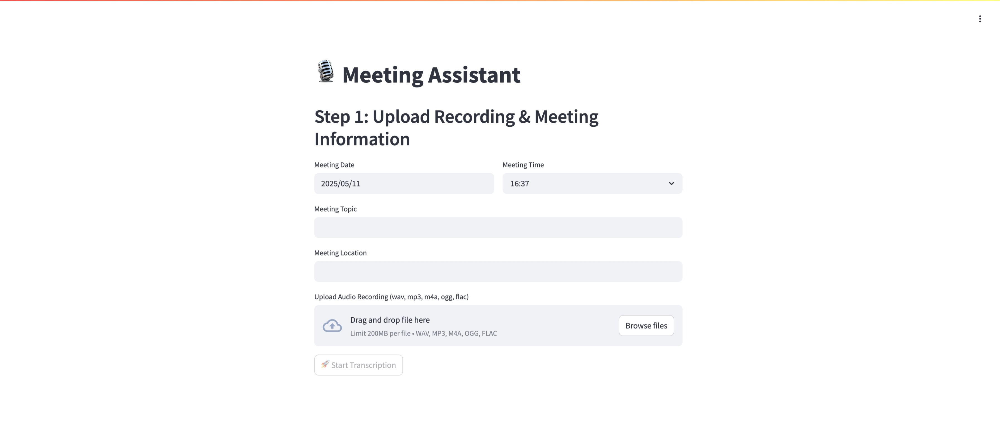

# 📋 Meeting Assistant

A full-stack application to transcribe meeting audio and generate structured meeting minutes using FastAPI, FunASR, and Streamlit. 🚀



## ✨ Features

| Emoji | Feature                              | Description                                                                                            |
| :---: | :----------------------------------- | :----------------------------------------------------------------------------------------------------- |
|   🎙  | **Asynchronous Audio Transcription** | Upload audio files and process them in the background with FunASR.                                     |
|   🔊  | **Speaker Diarization & Formatting** | Automatically detect speakers, merge consecutive segments, and format timestamps.                      |
|   ✍️  | **Interactive Editing**              | Edit raw transcripts and map speaker labels to real names using a Streamlit ACE editor.                |
|   🤖  | **AI-Generated Summaries**           | Generate structured meeting minutes (Markdown) via LLM (e.g., Qwen, OpenAI) with customizable prompts. |
|   📥  | **Downloadable Output**              | Export the final meeting minutes as a Markdown file.                                                   |

## 🚀 Installation

Follow these steps to set up the environment and install dependencies:

```bash
# Create environment
echo "Creating meeting_assistant environment..."
mamba create -n meeting_assistant python=3.10 -c conda-forge -y
conda activate meeting_assistant

# Install dependencies
pip install torch torchvision torchaudio \
    -i https://mirrors.tuna.tsinghua.edu.cn/pypi/web/simple
pip install funasr openai streamlit streamlit-ace \
    -i https://mirrors.tuna.tsinghua.edu.cn/pypi/web/simple
mamba install fastapi uvicorn python-dotenv requests librosa ffmpeg onnxruntime -c conda-forge -y
```

## ⚙️ Configuration

Copy `.env.example` to `.env` and adjust settings:

```env
# Backend Settings
APP_PORT_BACKEND=8401
ASR_MODEL_NAME="damo/speech_paraformer-large-vad-punc_asr_nat-zh-cn-16k-common-vocab8404-pytorch"
ASR_VAD_MODEL="fsmn-vad"
ASR_VAD_MODEL_REVISION="v2.0.4"
ASR_PUNC_MODEL="ct-punc"
ASR_PUNC_MODEL_REVISION="v2.0.4"
ASR_SPK_MODEL="cam++"
ASR_SPK_MODEL_REVISION="v2.0.2"
ASR_DEVICE="cuda"

# Frontend Settings
BACKEND_API_URL="localhost"
LLM_API_URL="https://api.openai.com/v1/chat/completions"
LLM_API_KEY="YOUR_API_KEY"
LLM_MODEL_NAME="gpt4.1-mini"
```

## 🏃‍♂️ Running the Application

### 1. Start Backend

```bash
python main.py
# or
uvicorn main:app --host 0.0.0.0 --port $APP_PORT_BACKEND --reload
```

### 2. Start Frontend

```bash
# Chinese UI
streamlit run app.py

# English UI
streamlit run app2.py
```

Open the URL displayed by Streamlit (e.g., `http://localhost:8501`). 🌐 

## 🛠 Usage

1. **Upload Audio** 🎧: Step 1 – select and upload a meeting audio file.
2. **Transcribe** 🕒: Step 2 – submit for ASR and wait for completion.
3. **Edit & Map** ✏️: Correct transcription errors and map speaker IDs to names.
4. **Generate Minutes** 📝: Use LLM to create a structured Markdown summary.
5. **Download** 💾: Save the generated meeting minutes locally.

## 📡 API Endpoints

* `POST /api/transcribe` – Submit audio file, returns a `task_id`.
* `GET /api/job/{task_id}` – Poll transcription status and retrieve the result.
* `GET /` – Health check endpoint.